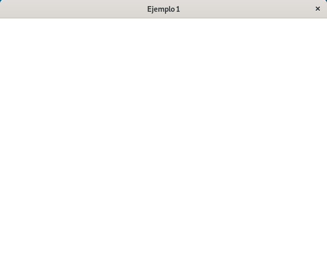
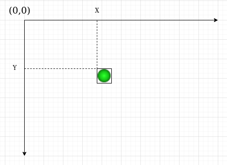
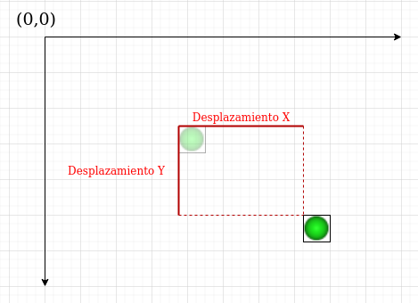
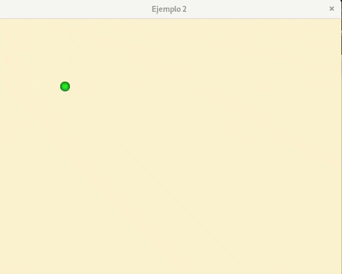
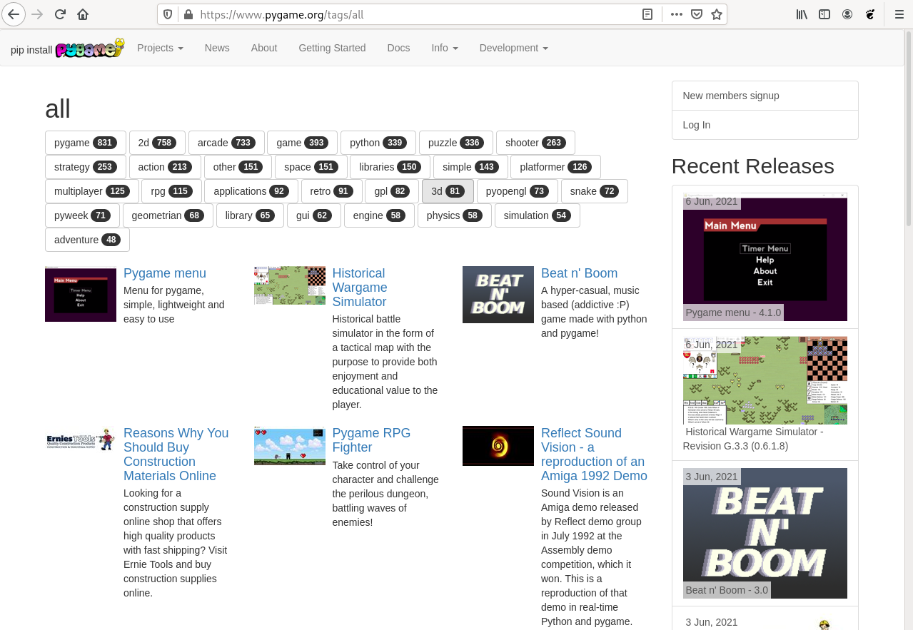

# pyGame: Realizando juegos con Python

Aunque el desarrollo de videojuegos en la actualidad, es una actividad multidisplinar, en la que intervienen muchos profesionales de diversos campos, puede ser muy adecuado para introducir a nuestros alumnos en la programación y en el desarrollo del pensamiento computacional. 

La programación de videojuegos es un caso particular de desarrollo de software, por lo tanto vamos a conseguir potenciar en nuestros alumnos las capacidades propias de las enseñanzas de la programación, como pueden ser: la abstracción, la búsqueda de soluciones a determinados problemas y el desarrollo de programas de ordenador que lo solucionen.W Pero además podemos conseguir que nuestros alumnos consigan otras destrezas, como pueden ser: el trabajo colaborativo en grupo, el desarrollo de la creatividad o el aumento de la motivación y la confianza en afrontar nuevos retos.

Python es un lenguaje de programación muy adecuado para introducirse en el mundo de la programación. Además, en este caso concreto, en el desarrollo de videojuegos, Python nos ofrece varias librerías que nos facilitan la creación de videojuegos. En este recurso vamos a usar el módulo [pyGame](https://www.pygame.org/news), que nos permite la creación de videojuegos en dos dimensiones de una manera sencilla. Mediante PyGame podemos utilizar sprites (objetos), cargar y mostrar imágenes en diferentes formatos, sonidos, etc. Además, al ser un módulo destinado a la programación de videojuegos se puede monitorizar el teclado o joystick de una manera bastante sencilla.

## ¿Qué debo saber para empezar a trabajar con este recurso?

### Niveles a los que va dirigido

Bachillerato y Formación Profesional

### Asignatura/s

En Bachillerato este recurso se podría utilizar en cualquier asignatura donde se este impartiendo conceptos de introducción a programación con Python. En Formación Profesional, este recurso puede ser apropiado, para los ciclos de la Familia Profesional de Informática donde se imparta la introducción a la Programación.

Además, puede servir para que se trabaje en algún proyecto transversal entre varias asignaturas. Normalmente el desarrollo de videojuegos, como hemos indicado anteriormente, necesita de varias disciplinas para llevarlo a cabo: matemáticas, física, dibujo, lengua, ...

### ¿Se requieren conocimientos previos?¿cuáles son?

Para realizar este recurso es necesario tener conocimientos previos de programación con Python: instalación de python en el sistema operativo, estructura de un programa, ejecución de un programa, trabajo con datos, tipos de datos y variables, estructuras de programación: secuencial, alternativas y repetitivas.

### ¿Qué objetivos se persigue con el recurso?

Los objetivos que se van a conseguir con la realización de este recurso son:

* Conocer la funcionalidades básicas de la librería pyGame, para permitir que los alumnos puedan desarrollar juegos utilizando los conocimientos de programación que poseen.
* Repasar los conceptos fundamentales de programación, de una manera más atractiva.
* Desarrollar la creatividad. Una vez que aprendan, con la realización de este recurso, los fundamentos para desarrollar juegos con pyGame, el alumno estará capacitado para seguir explorando las posibilidades que ofrece el desarrollo de videojuegos.
* Fomentar el trabajo en grupo. Como hemos apuntando anteriormente, el desarrollo de videojuegos es una actividad multidisplinar, por lo que sería muy sencillo que un grupo de alumnos, utilizando trabajo colaborativo, puedan desarrollar algún proyecto relacionado con la creación de videojuegos.

### ¿En qué consiste el recurso?

En este recurso vamos a introducir el desarrollo de un pequeño juego, usando la librería pyGame de Python. Vamos a crear un juego donde tenemos una pelota que va rebotando en los bordes de la ventana y controlamos una plataforma en la parte inferior de la pantalla que hace rebotar la pelota. El jugador tiene que evitar que la pelota llegue al borde inferior de la ventana.

## Y ahora que sé para que sirve, ¿cómo lo pongo en práctica?

Vamos a crear distintos programas que nos vayan acercando a la versión final del juego. Cada programa lo podemos construir en una sesión de clase para que el alumno le de tiempo de ir asimilando el funcionamiento. Empecemos:

### Sesión 1: Construir la ventana del juego

En esta primera sesión, vamos a crear y configurar la ventana que vamos a usar posteriormente para dibujar los elementos de nuestro juego.

Lo primero que tenemos que entender es la estructura que va a tener los juegos que desarrollemos con pyGame:

1. **Se crea y configura la ventana del juego**, con los elementos que va a tener nuestro juego.
2. **Se comprueban los eventos**: Dentro de un bucle, comprobamos los posibles eventos que se han producido, por ejemplo, hemos pulsado el botón de cierre de la ventana y el juego concluye, o hemos pulsado una determinada tecla,...
3. **Se actualiza la pantalla**: Según la lógica del juego o de algún evento que haya sucedido, se modifican los elementos (se mueve la pelota, se mueve la plataforma,...) y se vuelve a dibujar en la pantalla.

En esta primera sesión vamos a crear un programa, que nos muestra una ventana sin ningún elemento. Este programa puede servir a los alumnos como plantilla para que desarrollen sus propios juegos. El primer ejemplo lo tenemos en el fichero [`ejercicio1.py`](ejercicio1.py) y sería el siguiente:

```python
import pygame
# Inicialización de Pygame
pygame.init()
# Inicialización de la superficie de dibujo
ventana = pygame.display.set_mode((640,480))
pygame.display.set_caption("Ejemplo 1")
# Bucle principal del juego
jugando = True
while jugando:
    # Comprobamos los eventos
    #Comprobamos si se ha pulsado el botón de cierre de la ventana
    for event in pygame.event.get():
        if event.type == pygame.QUIT:
            jugando = False
    # Se pinta la ventana con un color
    # Esto borra los posibles elementos que teníamos anteriormente
    ventana.fill((255, 255, 255))
    # Todos los elementos del juego se vuelven a dibujar
    pygame.display.flip()
    # Controlamos la frecuencia de refresco (FPS)
    pygame.time.Clock().tick(60)
pygame.quit()
```

Veamos con detalle el programa:

1. Es necesario importar el módulo pygame (`import pygame`) y a continuación se inicializaría el módulo (`pygame.init()`).
2. Creamos y configuramos la ventana del juego:
    * Con `pygame.display.set_mode` se crea una ventana con el tamaño señalado. Se genera un objeto `ventana` que representa nuestra ventana de juego.
    * Con `pygame.display.set_caption` se configura el título de la ventana.
3. La parte central del programa es un bucle que repite las siguientes instrucciones:
    * El método `pygame.event.get()` nos devuelve una lista con los posibles eventos que han sucedido en el juego. Usamos una instrucción `for` para comprobar esta lista de eventos.
    * En este ejemplo, comprobamos el evento de pulsar el botón de cierre de la ventana. Esto ocurre cuando el tipo de evento (`event.type`) es igual al valor `pygame.QUIT`. Si esta condición ocurre se modificará la variable `jugando` que hará que el bucle principal del juego termine.
    * En el bucle principal se actúa sobre los elementos de la ventana. En nuestro caso no tenemos ninguno.
    * Se borran los posibles elementos que tengamos, pintando la pantalla de un color: `ventana.fill((252, 243, 207))`. en este caso usando la notación [RGB](https://es.wikipedia.org/wiki/RGB) lo pintamos de amarillo claro.
    * Volvemos a pintar los elementos en su nueva posición: `pygame.display.flip()`, controlando en todo momento que la frecuencia de refresco de la imagen sea de 60 [fps](https://es.wikipedia.org/wiki/Fotogramas_por_segundo).
4. Si salimos del bucle principal se ha terminado el programa: `pygame.quit()`.

Si ejecutamos el programa: `python3 ejemplo1.py`, nos debe aparecer una ventana como esta:



### Sesión 2: Añadimos la pelota a nuestro juego

En esta sesión vamos a modificar el ejemplo anterior, para incluir el primer objeto a nuestro juego: una pelota que se moverá e irá rebotando por los bordes de la ventana.

La pelota va a ser una imagen que tenemos en nuestro directorio: [`ball.png`](ball.png). El [`ejercicio2.py`](ejercicio2.py) quedaría de la siguiente forma:

```python
import pygame
pygame.init()
ventana = pygame.display.set_mode((640,480))
pygame.display.set_caption("ejercicio 2")
# Crea el objeto pelota
ball = pygame.image.load("ball.png")
# Obtengo el rectángulo del objeto anterior
ballrect = ball.get_rect()
# Inicializo los valores con los que se van a mover la pelota
speed = [4,4]
# Pongo la pelota en el origen de coordenadas
ballrect.move_ip(0,0)
jugando = True
while jugando:
    for event in pygame.event.get():
        if event.type == pygame.QUIT:
            jugando = False
    # Muevo la pelota
    ballrect = ballrect.move(speed)
    # Compruebo si la pelota llega a los límites de la ventana
    if ballrect.left < 0 or ballrect.right > ventana.get_width():
        speed[0] = -speed[0]
            
    if ballrect.top < 0 or ballrect.bottom > ventana.get_height():
        speed[1] = -speed[1]
    
    ventana.fill((252, 243, 207))
    # Dibujo la pelota
    ventana.blit(ball, ballrect)
    pygame.display.flip()
    pygame.time.Clock().tick(60)
pygame.quit()
```

Antes de explicar las nuevas instrucciones que hemos introducido en este ejemplo, tenemos que aprender como posicionamos y movemos los objetos dentro de la ventana. Cada objeto se representa por el rectángulo que ocupa, y se posiciona en la ventana indicando la ordenada X (posición horizontal) y la ordenada Y (posición vertical). Tenemos que saber que el origen de coordenadas (0,0) se encuentra en la esquina superior izquierda. 



Para mover un objeto necesitaremos dos valores: uno para indicar el desplazamiento lateral (ordenada X), si es positivo desplazaremos el objeto a la derecha, si es negativo a la izquierda; y otro para indicar el desplazamiento vertical (ordenada Y), si es positivo se moverá hacia abajo, si es negativo hacía arriaba.



Ya podemos explicar las nuevas instrucciones que hemos incluido para mover la pelota:

1. A partir de una imagen png, creamos un objeto imagen (`ball = pygame.image.load("ball.png")`), pero como hemos comentado vamos a posicionar el rectángulo que ocupa la imagen. Para obtener dicho rectángulo hemos ejecutado `ballrect = ball.get_rect()`.
2. Inicializamos una lista con dos valores, que llamamos `speed`. El primer valor representa el desplazamiento horizontal, y el segundo el desplazamiento vertical. Lo utilizaremos para mover la pelota.
3. Posicionamos la pelota en el origen de coordenadas: `ballrect.move_ip(0,0)`.
4. Dentro del bucle del juego: movemos la pelota con los datos guardados en la lista `speed`: `ballrect = ballrect.move(speed)`.
5. Y comprobamos si ha llegado a algún borde: 
    * Podemos obtener la posición del rectángulo que representa la pelota con `ballrect.left` (posición izquierda), `ballrect.rigth` (posición derecha), `ballrect.top` (posición superior) y `ballrect.bottom` (posición inferior).
    * Si la posición izquierda es menor que 0 o la posición derecha es mayor que la anchura de la ventana (`ventana.get_width()`) habremos tocado los bordes laterales. En esta situación cambiamos el signo del primer dato guardado en `speed`, es decir, si se movía a la derecha ahora se moverá a la izquierda, y al contrario.
    * Si la posición superior es menor que 0 o la posición inferior es mayor que la altura de la ventana (`ventana.get_height()`) habremos tocado los bordes superior o inferior. En esta situación cambiamos el signo del segundo dato guardado en `speed`, es decir, si se movía hacía abajo ahora se moverá hacía arriba, y al contrario.
6. Finalmente volvemos a pintar la pelota en la ventana (`ventana.blit(ball, ballrect)`).

Y ya podemos ejecutar el programa (`python3 ejercicio2.py`):



### Sesión 3: Añadimos el bate a nuestro juego

En esta sesión, partiendo de lo que habíamos realizado en la anterior, vamos a añadir otro objeto a nuestro juego: un bate, que controlaremos con el cursor derecho e izquierdo. La pelota al tocar el bate rebotará. El fichero [`ejercicio3.py`](ejercicio3.py) quedaría de la siguiente manera:

```python
import pygame
pygame.init()
ventana = pygame.display.set_mode((640,480))
pygame.display.set_caption("Ejemplo 3")
ball = pygame.image.load("ball.png")
ballrect = ball.get_rect()
speed = [4,4]
ballrect.move_ip(0,0)
# Crea el objeto bate, y obtengo su rectángulo
bate = pygame.image.load("bate.png")
baterect = bate.get_rect()
# Pongo el bate en la parte inferior de la pantalla
baterect.move_ip(240,450)
jugando = True
while jugando:
    for event in pygame.event.get():
        if event.type == pygame.QUIT:
            jugando = False
    # Compruebo si se ha pulsado alguna tecla
    keys = pygame.key.get_pressed()
    if keys[pygame.K_LEFT]:
        baterect = baterect.move(-3,0)
    if keys[pygame.K_RIGHT]:
        baterect = baterect.move(3,0)
    # Compruebo si hay colisión
    if baterect.colliderect(ballrect):
        speed[1] = -speed[1]
 
    ballrect = ballrect.move(speed)
    if ballrect.left < 0 or ballrect.right > ventana.get_width():
        speed[0] = -speed[0]
    if ballrect.top < 0 or ballrect.bottom > ventana.get_height():
        speed[1] = -speed[1]
    ventana.fill((252, 243, 207))
    ventana.blit(ball, ballrect)
    # Dibujo el bate
    ventana.blit(bate, baterect)
    pygame.display.flip()
    pygame.time.Clock().tick(60)
pygame.quit()

```
Veamos las nuevas instrucciones que hemos añadido:

1. Ahora el objeto bate se crea a partir de otra imagen (`bate = pygame.image.load("bate.png")`), obtenemos el rectángulo que ocupa (`baterect = bate.get_rect()`) y lo colocamos en su posición inicial (`baterect.move_ip(240,450)`).
2. Dentro del bucle, comprobamos si hemos pulsado alguna tecla. Con `keys = pygame.key.get_pressed()` obtenemos una lista con las teclas que se han pulsado. 
3. Si hemos pulsado el cursor izquierdo (`if keys[pygame.K_LEFT]:`) movemos el bate tres posiciones a la izquierda (`baterect = baterect.move(-3,0)`).
4. Si hemos pulsado el cursor derecho (`if keys[pygame.K_RIGHT]:`) movemos el bate tres posiciones a la derecha (`baterect = baterect.move(3,0)`).
5. Finalmente, volvemos a pintar el bate en la ventana (`ventana.blit(bate, baterect)`).

Y ya podemos ejecutar el programa (`python3 ejercicio2.py`):


### Sesión 4: Terminamos nuestro juego

En esta sesión no vamos a explicar el código del último ejemplo. El alumno, estudiando el código del programa [`ejercicio4.py`](ejercicio4.py) tendrá que buscar las instrucciones que hemos añadido y que nos permiten realizar las siguientes mejoras:

1. En cada ejecución la pelota tiene una velocidad distinta.
2. Ahora la pelota al rebotar, puede cambiar el angulo de rebote.
3. Al tocar el borde inferior has perdido el juego.
4. Al perder el juego se pone el texto "Game Over".

A continuación le podemos proponer al alumno otras mejoras en el juego.

1. Aceleración del movimiento del bate al dejar pulsado los cursores.
2. En cada rebote, cambio del ángulo del cambio de la trayectoria.
3. Aceleración de la pelota cada cierto tiempo.
4. Podríamos incluir algunos objetos "ladrillos" y crear un juego parecido al "Arkanoid".
5. O introducir otro bate, que se controle con otras dos teclas y hacer un juego parecido al "Pong".

## ¿Qué habilidades de los alumnos desarrollo que no se pueden obtener de manera más tradicional?

En el aprendizaje tradicional de la programación se utilizan muchos ejemplos que no siempre son atractivos o conocidos para los alumnos. Programar un juego puede ser motivador, al conocer las dinámicas y funcionalidades de los juegos, lo que facilita que el alumnado se implique en esta tarea.

Además la programación de juegos puede ser una actividad transversal entre las asignaturas donde se esté impartiendo la introducción a la programación y otras materias. Por ejemplo, en muchas ocasiones, conceptos matemáticos son necesarios para realizar la lógica del juego, el diseño de los gráficos  se puede realizar en la asignatura de dibujo, o incluso, el guión se puede desarrollar en la asignatura de lengua,...

## ¿Qué ventaja obtengo de utilizar este recurso en el aula?

La creación de juegos con Python puede desarrollar en el alumno: una motivación adicional a la hora de aprender conceptos sobre programación, la creatividad del alumno en el proceso del desarrollo de un juego, y favorecer el trabajo colaborativo.

Otra ventaja que podemos obtener al utilizar la librería pyGame, es que el alumno pueda ir aprendiendo aspectos del desarrollo de juegos con Python accediendo directamente al código fuente de muchos juegos realizados por los miembros de la comunidad. De esta forma, la página web de pyGame ofrece un [repositorio](https://www.pygame.org/tags/all) con el código de muchos juegos desarrollados con esta herramienta:

  

## ¿Qué materiales necesito para ponerlo en práctica en el aula?

Necesitamos un ordenador con Python 3 y con la librería pyGame instalada (se puede seguir esta [guía](https://www.pygame.org/wiki/GettingStarted)). Para codificar el programa podemos usar cualquier editor de texto.