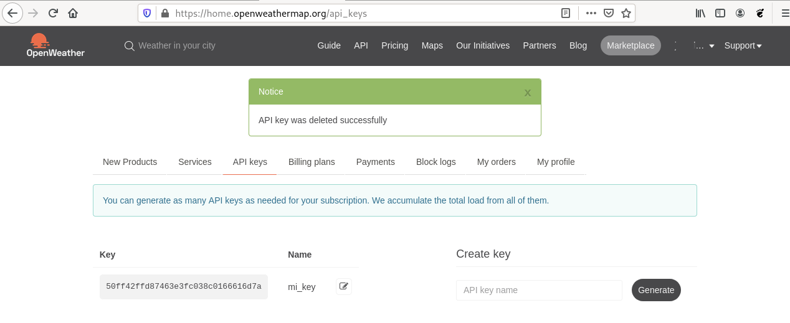
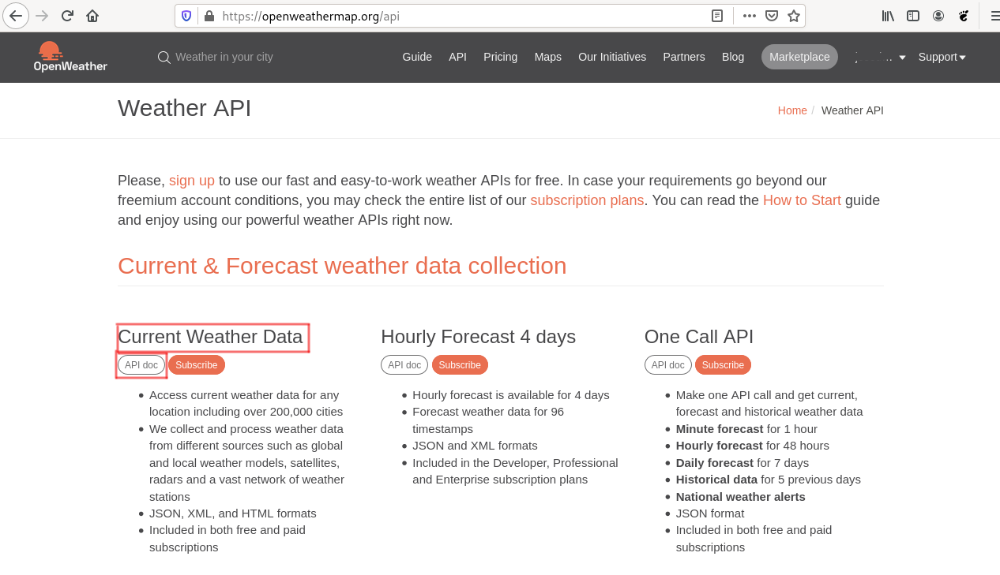
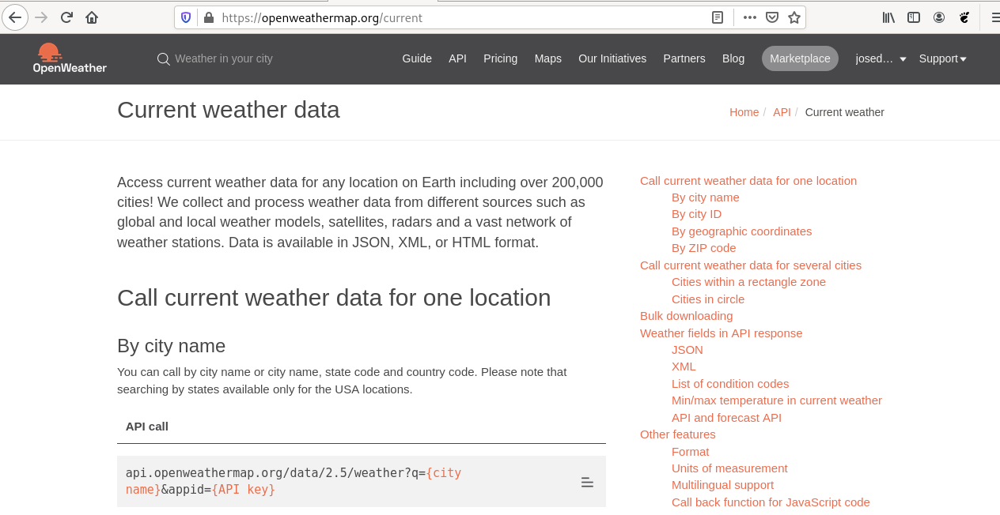

# Consulta el tiempo atmosférico con Python

Un programa de ordenador recibe datos de entrada, procesa de forma automáticamente estos datos y genera unos datos de salida, nos devuelve una información.

Los datos de entrada, normalmente son introducidos por el usuario. En otras ocasiones los datos con los que trabaja el programa están guardados en ficheros o en bases de datos. Pero, ¿y si pudiéramos utilizar los datos que tenemos disponible en internet para realizar nuestros programas?

Actualmente, una de las fuentes de información más importante que tenemos son las páginas web disponibles en internet. Los usuarios podemos consultar distintas páginas web y la información se nos muestra con una estructura determinada: el lenguaje HTML, que está pensado para representar la información de manera sencilla.

Sin embargo, ¿podríamos crear programas que tomaran como datos de entrada la información ofrecida por alguna página web?. La respuesta es sí, pero no vamos a utilizar directamente una página web, vamos a usar lo que conocemos como **Servicio web**. Hay distintos tipos de Servicios web, nosotros vamos a utilizar los servicios web REST (RESTful web API) que son un mecanismo de comunicación que nos permite que un programa se comunique con otro. En este caso la información que se comparte tiene que estar estructurada para que sea fácil gestionarla con un programa. En este recurso el lenguaje que estructura la información que vamos a utilizar será JSON.

## ¿Qué debo saber para empezar a trabajar con este recurso?

### Niveles a los que va dirigido

Bachillerato y formación Profesional

### Asignatura/s

### ¿Se requieren conocimientos previos?¿cuáles son?

### ¿Qué objetivos se persigue con el recurso?


### ¿En qué consiste el recurso?

Vamos a desarrollar un programa en Python que nos posibilite consultar el tiempo atmosférico que tenemos en nuestra ciudad. Para ello el programa, se comunicara con el servicio web RESTful API de `openwheather`.

## Y ahora que sé para que sirve, ¿cómo lo pongo en práctica?

### Paso 1: Entendiendo la diferencia entre aplicación web y servicio web

Como ya hemos presentado en la introducción del recurso, las páginas web o aplicaciones web están pensada para que las personas consulten información. De esta manera si quiero saber los datos atmosféricos de mi ciudad puedo a acceder a la página [openweathermap.org](https://openweathermap.org) y hacer una búsqueda de mi ciudad:


Los datos son recibidos utilizando el lenguaje HTML y utilizando Hojas de Estílo (CSS) para darle formato. De esta manera la persona recibe está información de manera muy clara.

Pero, ¿y si queremos desarrollar un programa que haga la misma consulta y que pueda procesar esa información de forma automática? En este caso necesitaríamos consulat el servicio web RESTful de openwhether: [https://openweathermap.org/api](https://openweathermap.org/api) y la información recibida vendría estructurada con otro lenguaje de marcado, en nuestro caso utilizaremos JSON. Lo vemos en el siguiente punto.

### Paso 2: Usando el servicio web RESTful de OpenWheather

Aunque algunos servicios web RESTful se pueden usar sin ninguna restricción, otros, como el de OpenWheather, es necesario que nos identifiquemos para su utilización. En este caso el proceso de autentficación se hace mediante una clave personal (**API key**). Lo primero que vamos a hacer es obtener nuestra clave personal, para ello:

1. Nos registramos en la página de OpenWheather
2. Accedemos con el usuario y contraseña que hemos indicado.
3. Accedemos al apartado *API Keys* y generamos una nueva key.

    

Ya podemos ver la clave que se nos asignado. Tenemos que tener en cuenta que esta clave es como nuestra contraseña, nos identifica en el servicio web, por lo que es importante que la protejamos de forma adecuada.



Una vez que tenemos nuestra API key, vamos a usar por primera vez una API RESTful de OpenWheather. 

En realidad el uso es muy parecido a acceder a una página web, es decir, vamos a hacer una petición HTTP a una URL que nos devolverá una información determinada. Normalmente las URL de las API RESTful tienen una serie de parámetros que nos permiten configurar la consulta, y nos devolverá una información con una cierta estructura. La pregunta sería: ¿Cómo sabemos las URL, los parámetros y la estructura de la información recibida de una API RESTful? La respuesta a esta pregunta es: estudiando la documentación de la API RESTful que queremos usar.

Accedemos a la opción *API* y nos aparecen los distintos servicios web que podemos usar. Nosotros para este recurso vamos a usar **Current Weather Data**:



Pulsamos sobre la opción *API doc* y accedmos a la documentación de esta API:



En la documentación podemos aprender muchas cosas:

* Las URL que que tengo que usar para realizar búsqueda de ciudades: por nombre, por identificador, por coordenadas geográficas, por códigos postales,...
* Los parámetros que puedo indicar en la URL para configurar la consulta.
* La estructura de la información recibida

En nuestro caso vamos a hacer una consulta de una ciudad por nombre, por lo que la URL que voy a usar es:

`api.openweathermap.org/data/2.5/weather`

Los parámetros que voy a indicar serán:

* `q`: Para indicar el nombre de la ciudad.
* `appid`: Para indicar la API key.
* `units`: Para indicar las unidades de medidas. Vamos a usar `metric`.

Por lo tanto, si queremos consultar la ciudad "Sevilla", tenemos que hacer una petición a la URL:

`https://api.openweathermap.org/data/2.5/weather?q=Sevilla&appid=50ff42ffd87463e3fc038c0166616d7a&units=metric`

Vamos a usar un navegador web para obtener la salida de una forma más visual, si elegimos la opción de *Datos sin procesar* podremos ver la información devuelta en su formato JSON original:


### Paso 3: Introducción a JSON

El lenguaje de marcas JSOn nos sirve para estructurar información de distinto tipo: números, cadenas de caracteres, booleanos, arrays y objetos. Los arrays representa una lista de datos gaurdada entree corchetes (`[` y `]`) y los objetos son colecciones no ordenadas de pares de la forma **<clave>:<valor>**, separados por comas y guardas entre llaves (`{` y `}`).

La consulta anterior que hemos recibido nos ha devuelto la siguiente información:

```
{"coord":{"lon":-5.9761,"lat":37.3824},"weather":[{"id":800,"main":"Clear","description":"clear sky","icon":"01d"}],"base":"stations","main":{"temp":24.04,"feels_like":23.96,"temp_min":22.95,"temp_max":24.44,"pressure":1017,"humidity":56},"visibility":10000,"wind":{"speed":2.24,"deg":58,"gust":4.47},"clouds":{"all":0},"dt":1623052825,"sys":{"type":2,"id":2011488,"country":"ES","sunrise":1623042197,"sunset":1623094954},"timezone":7200,"id":2510911,"name":"Seville","cod":200}
```

Aquí podemos encontrar toda la información meteorológica de la ciudad de Sevilla. Nostros posteriormente nos quedaremos con el objeto cuya calve es `main` donde encontramos la temperatura actual (`temp`), la sensación térmica (`feels_like`), la temperatura mínima (`temp_min`), la máxima (`temp_max`), la presión (`pressure`) u la humedad (`humidity`).

cuando trabajamos con JSON desde un programa Python, los arrays JSON se convierten en listas Python, y los objetos JSON se convierten en diccionarios Python. Lo veremos en el siguiente punto:

### Paso 4: ¿Cómo hacemos un programa Python que haga una consulta al servicio web de OpenWheather?


## ¿Qué habilidades de los alumnos desarrollo que no se pueden obtener de manera más tradicional?


## ¿Qué ventaja obtengo de utilizar este recurso en el aula?


## ¿Qué materiales necesito para ponerlo en práctica en el aula?

